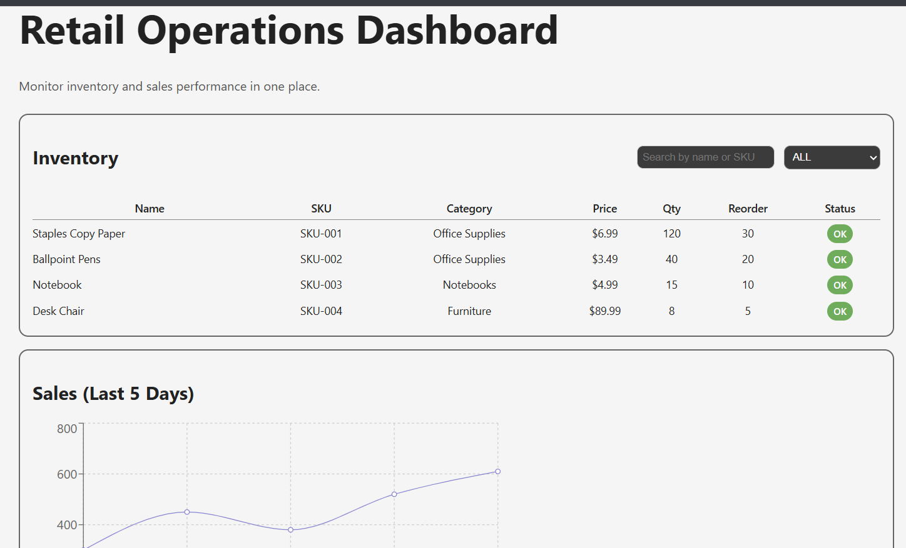
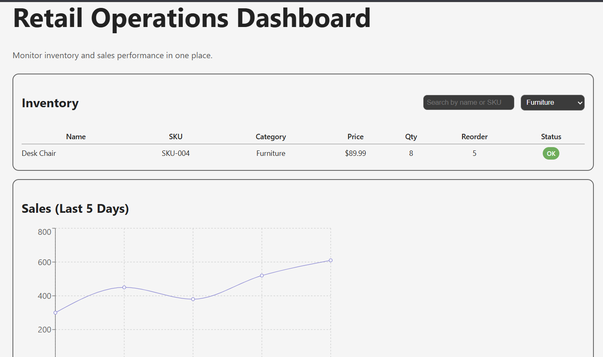
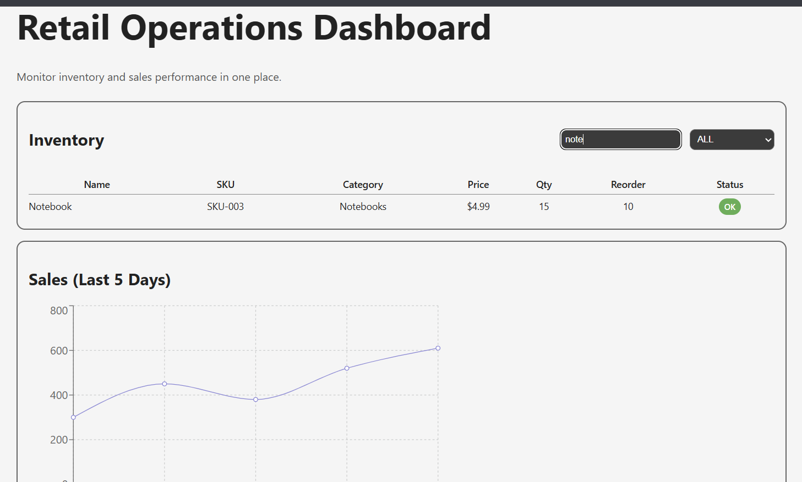
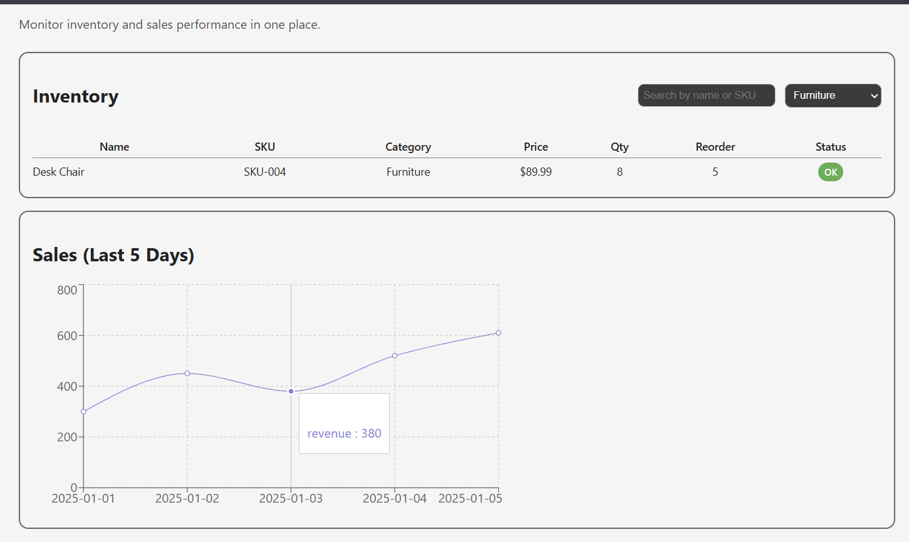

## 📘 About the Project
This project was created as a beginner-friendly React + TypeScript dashboard to practice working with components, state, filtering, and basic data visualization. It simulates a retail environment where users can view product inventory, check low stock alerts, and see recent sales trends in a simple, clean interface.
## 🎯 Learning Goals
- Strengthen understanding of React fundamentals  
- Practice working with TypeScript interfaces and props  
- Build reusable UI components  
- Learn how to visualize data using Recharts  
- Understand basic state management (search, filter)  
- Organize a real project structure using Vite  

## ✨ Features
- **Inventory Table:** Displays products with price, stock, category, and reorder level.
- **Search Function:** Search by product name or SKU.
- **Category Filter:** Filter items by product category.
- **Low Stock Badge:** Highlights items that are below their reorder level.
- **Sales Chart:** Visualizes revenue over the last 5 days using Recharts.
- **Responsive Layout:** Adjusts layout based on screen size (flexbox).

## 🧠 How It Works
- The app loads mock product and sales data.
- Users can filter or search products in the inventory table.
- A badge appears next to items that are low on stock.
- Sales data is passed into a Recharts `<LineChart>` to show trends visually.

## 📸 Screenshots

### Overall Look

### Inventory Table Options

### Sales Chart

